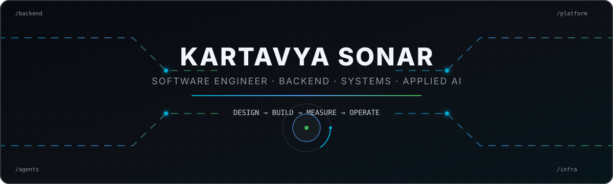
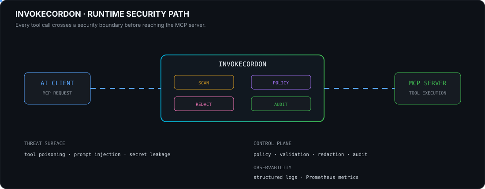
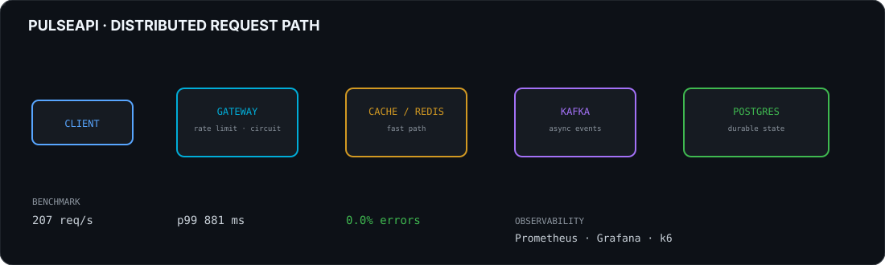
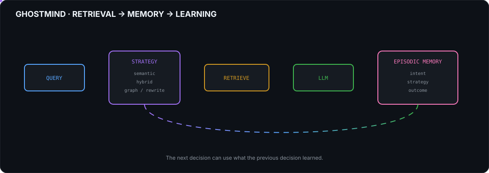
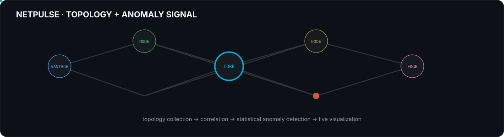
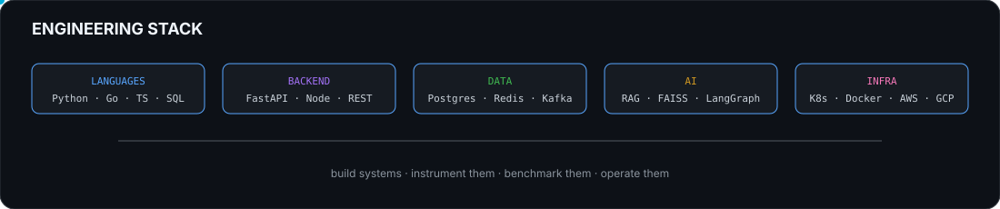

<p align="center">
  
</p>

<p align="center">
  <a href="https://github.com/Kartavyasonar"></a>
  <a href="https://linkedin.com/in/kartavya-sonar23"></a>
  <a href="mailto:sonarkartavya@gmail.com"></a>
  <a href="https://leetcode.com/u/sonarkartavya/"></a>
  <a href="https://codeforces.com/profile/Kartavyasonar"></a>
</p>

# `01` · ABOUT

I am a **Software Engineer** focused on backend systems, distributed infrastructure, cloud-native engineering and applied AI.

I build systems where the interesting part is not just the UI — it is the machinery underneath:

- asynchronous APIs and services
- distributed state and caching
- message-driven systems
- Kubernetes and cloud infrastructure
- AI agents and retrieval systems
- MCP / AI-agent security
- observability and performance benchmarking
- developer tooling and open source

**Engineering preference:** make the boundary explicit, measure the behaviour, expose the failure, then iterate.

### Education

| Degree | Institution | Result |
|---|---|---|
| MSc Advanced Computer Science | University of Leeds | Merit · 2024–2025 |
| B.Tech Computer Science | GGSIPU / Delhi Technical Campus | 8.24 CGPA · 2021–2024 |
| Diploma in Computer Technology | MSBTE | 87.09% · 2018–2021 |

---

# `02` · CURRENT SYSTEM

## 🛡️ InvokeCordon

**MCP security scanner + runtime JSON-RPC gateway**

The project places a security boundary between an AI client and MCP servers.

```text
AI CLIENT
   │
   │ MCP / JSON-RPC
   ▼
┌──────────────────────────────┐
│        INVOKECORDON          │
│                              │
│  scan → policy → redact      │
│        → audit → metrics     │
└──────────────┬───────────────┘
               │
               ▼
           MCP SERVER
               │
               ▼
          TOOL EXECUTION
```

### What the gateway is designed to address

`tool poisoning` · `prompt injection` · `secret leakage` · `unsafe tool execution` · `auditability`

<p align="center">
  
</p>

### Security pipeline

| Stage | Function |
|---|---|
| **Scan** | Inspect tool definitions and request characteristics |
| **Policy** | Apply execution rules before forwarding |
| **Redact** | Prevent sensitive values from leaking into outputs/logs |
| **Audit** | Record security-relevant execution events |
| **Metrics** | Expose runtime behaviour through Prometheus |
| **Gateway** | Maintain a controlled AI-client → MCP-server boundary |

Repository: **https://github.com/Kartavyasonar/toolgate**

> The repository currently contains the implementation under the `toolgate` name; the portfolio uses **InvokeCordon** as the project identity while the naming transition is being handled.

---

# `03` · SYSTEMS I HAVE BUILT

## ⚡ PulseAPI — Distributed API Gateway

**Node.js · Redis · Kafka · PostgreSQL · Prometheus · Grafana · k6**

<p align="center">
  
</p>

### Runtime characteristics

```text
                 REQUEST
                    │
                    ▼
              ┌──────────┐
              │ GATEWAY  │
              └────┬─────┘
                   │
          ┌────────┴────────┐
          ▼                 ▼
       REDIS              KAFKA
     fast state         async work
          │                 │
          └────────┬────────┘
                   ▼
               POSTGRES
```

### Measured benchmark

| Metric | Result |
|---|---:|
| Throughput | **207 req/s** |
| p99 latency | **881 ms** |
| Error rate | **0.0%** |

---

## 🧠 GhostMind — Self-Evolving Research Agent

**Python · FastAPI · FAISS · NetworkX · React/Vite · SQLite**

GhostMind combines multiple retrieval strategies with episodic memory and strategy selection.

<p align="center">
  
</p>

### Retrieval modes

```text
SEMANTIC
HYBRID
GRAPH
AGGRESSIVE REWRITE
```

The memory layer connects:

```text
intent → strategy → outcome
```

This gives the agent a mechanism for using previous retrieval experience when selecting a strategy for later queries.

---

## 🤖 AI Code Review

**LangGraph · ChromaDB · Groq LLaMA 3.3 70B · FastAPI · React/Vite · Python AST · Radon · SSE · Docker**

A multi-agent code analysis pipeline.

```text
REPOSITORY
    │
    ├── AST analysis
    ├── complexity analysis
    └── semantic chunking
            │
            ▼
       CHROMADB
            │
            ▼
 ┌───────────────────────────────┐
 │        SPECIALISTS            │
 │                               │
 │  BUGS · SECURITY · QUALITY    │
 │          PERFORMANCE          │
 └───────────────┬───────────────┘
                 ▼
            SYNTHESIZER
                 │
                 ▼
        STRUCTURED REVIEW
```

### Why it is interesting

The system combines **static analysis + retrieval + multiple specialist agents + synthesis**, rather than asking one LLM to perform every review task.

Repository: **https://github.com/Kartavyasonar/AI-CODE-REVIEW**

Live frontend: **https://ai-code-review-xi-one.vercel.app/**

---

## 🌐 NetPulse — Network Operations Platform

**FastAPI · PostgreSQL · NetworkX · Scapy · Nmap · React · Recharts · Docker**

<p align="center">
  
</p>

### Pipeline

```text
MULTIPLE VANTAGE POINTS
          │
          ▼
   TOPOLOGY COLLECTION
          │
          ▼
      CORRELATION
          │
          ▼
 STATISTICAL ANOMALY DETECTION
          │
          ▼
       LIVE GRAPH
```

Repository: **https://github.com/Kartavyasonar/NetPulse**

---

# `04` · APPLIED AI

## ⚖️ NYAYA AI

Multilingual legal-information assistant using hybrid retrieval.

```text
QUERY
  │
  ├───────────────┐
  ▼               ▼
FAISS            BM25
dense            sparse
  │               │
  └───────┬───────┘
          ▼
       RERANK
          │
          ▼
       LLM
          │
          ▼
      RESPONSE
```

Core technologies:

`FAISS` · `BM25` · reranking · Groq LLaMA · MongoDB Atlas · FastAPI · Twilio

---

## ✈️ WanderPlan

AI-assisted travel planning platform.

**React · Vite · Node/Express · PostgreSQL · Leaflet · OpenStreetMap**

Features include:

`maps` · `weather` · `cost estimation` · `packing lists` · `voice narration` · `calendar export` · `trip history` · `PWA`

Live: **https://wander-plan-orcin.vercel.app/**

Repository: **https://github.com/Kartavyasonar/WanderPlan**

---

# `05` · PERFORMANCE / INFRASTRUCTURE

## ☁️ Azure Functions vs OpenFaaS on K3s

**Docker · Helm · K3s · Kubernetes · Apache JMeter**

Compared identical Python inference endpoints across managed and self-hosted FaaS environments.

Measured:

```text
LATENCY
THROUGHPUT
COLD START
CONCURRENCY
SCALABILITY
ERROR RATE
```

Observed under the tested workload:

- 302 total requests
- 0.00% error rate
- lightweight workloads showed lower latency on Azure Functions
- OpenFaaS/K3s provided greater infrastructure control and predictability under sustained concurrency

The goal was not simply to ask *which platform is faster*, but to understand the **engineering trade-off between managed simplicity and infrastructure control**.

---

# `06` · OPEN SOURCE

## ☸️ Kubernetes

### PR #138993

**RunInUserNS() support for rootless user/network namespace testing in kube-proxy nftables**

Focus:

`Linux namespaces` · `rootless testing` · `kube-proxy` · `networking`

→ https://github.com/kubernetes/kubernetes/pull/138993

### PR #37058

**Prow presubmit CI jobs gated by custom build tags for namespace-isolation tests**

Focus:

`Prow` · `CI/CD` · `test infrastructure` · `namespace isolation`

→ https://github.com/kubernetes/test-infra/pull/37058

### Issue #139170

**ConfigMap BinaryData API behaviour/documentation**

Focus:

`Kubernetes API` · `ConfigMap` · `API behaviour`

→ https://github.com/kubernetes/kubernetes/issues/139170

---

# `07` · RESEARCH

## Mapping Public Emotion in Digital Governance

**MSc research — UK immigration discourse on Reddit**

```text
1,098 Reddit posts
       │
       ▼
   NLP processing
       │
       ├── BERTopic
       ├── transformer emotion analysis
       ├── semantic matching
       └── legislation mapping
       │
       ▼
 discourse / emotion analysis
```

Research areas:

`NLP` · `topic modelling` · `emotion analysis` · `digital governance` · `semantic matching`

Publication:

**Mapping Public Emotion in Digital Governance: A Comparative NLP Analysis of UK Immigration Discourse on Reddit**

---

# `08` · ENGINEERING STACK

<p align="center">
  
</p>

### Languages

`Python` · `Go` · `JavaScript` · `TypeScript` · `Java` · `C++` · `SQL`

### Backend

`FastAPI` · `Node.js` · REST APIs · async Python · microservices · JSON-RPC

### Distributed Systems

`Kafka` · `Redis` · `PostgreSQL` · Kubernetes · Docker

### AI / Retrieval

`LLMs` · `RAG` · `FAISS` · `ChromaDB` · embeddings · `LangGraph` · `NetworkX` · Transformers

### Cloud / Infrastructure

`AWS` · `GCP` · `Kubernetes` · `Docker` · `Linux` · `Nginx` · GitHub Actions

### Observability

`Prometheus` · `Grafana` · `k6`

---

# `09` · GITHUB

<p align="center">
  
  
</p>

<p align="center">
  
</p>

<p align="center">
  
</p>

---

# `10` · ENGINEERING PRINCIPLES

```text
01  Measure before optimizing.

02  Keep system boundaries explicit.

03  Prefer simple primitives when they are enough.

04  Make failure observable.

05  Treat security as part of architecture.

06  Benchmark the behaviour you claim.

07  Automate repetitive operational work.

08  Design for debugging — not only the happy path.
```

---

# `11` · CURRENT FOCUS

```text
BACKEND
   │
   ├── distributed APIs
   ├── asynchronous services
   ├── databases / caching
   │
   ▼
CLOUD-NATIVE
   │
   ├── Kubernetes
   ├── containers
   ├── observability
   │
   ▼
APPLIED AI
   │
   ├── agents
   ├── retrieval
   ├── memory
   │
   ▼
AI SECURITY
   │
   ├── MCP
   ├── tool security
   ├── policy enforcement
   └── auditing
```

---

# `12` · CONNECT

<p align="center">
  <a href="https://github.com/Kartavyasonar">GitHub</a> ·
  <a href="https://linkedin.com/in/kartavya-sonar23">LinkedIn</a> ·
  <a href="mailto:sonarkartavya@gmail.com">Email</a> ·
  <a href="https://leetcode.com/u/sonarkartavya/">LeetCode</a> ·
  <a href="https://codeforces.com/profile/Kartavyasonar">Codeforces</a> ·
  <a href="https://drive.google.com/file/d/1-AGCOuY3D7ZFyIm9LYpPwO-6G8LcLSHN/view?usp=sharing">CV</a>
</p>

<p align="center">
  <sub>Build systems. Instrument them. Break them. Understand them. Improve them.</sub>
</p>
