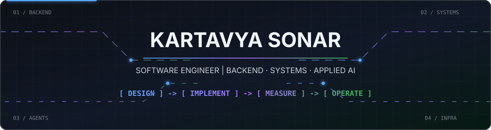
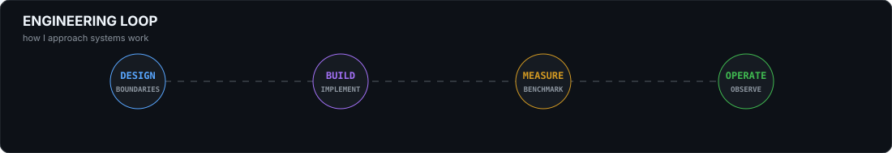
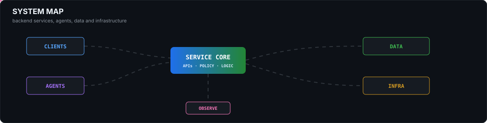

## About

Software engineer focused on **backend systems, distributed infrastructure, and applied AI**. I build APIs, agentic systems, retrieval pipelines, developer tooling, and production-oriented infrastructure — with an emphasis on measurable behaviour, reliability, and clear system boundaries.

## Professional Channels

## Selected Work

| Project | What it does | Built with |
| --- | --- | --- |
| [InvokeCordon](https://github.com/Kartavyasonar/toolgate) | MCP security gateway concept for intercepting tool calls, applying policy, redacting secrets, and recording audit events. | Go, MCP, JSON-RPC |
| [PulseAPI](#) | Distributed API gateway with caching, messaging, persistence, observability, and load-test measurements. | Node.js, Redis, Kafka, PostgreSQL |
| [GhostMind](#) | Research agent combining retrieval strategies, episodic memory, graph structure, and strategy selection. | Python, FAISS, NetworkX, FastAPI |
| [AI Code Review](https://github.com/Kartavyasonar/AI-CODE-REVIEW) | Multi-agent code analysis pipeline using AST/static analysis, retrieval, specialist reviewers, and synthesis. | Python, LangGraph, ChromaDB |
| [NetPulse](https://github.com/Kartavyasonar/NetPulse) | Distributed network monitoring and anomaly detection across multiple vantage points. | FastAPI, NetworkX, PostgreSQL |
| [NYAYA AI](#) | Multilingual legal assistant using hybrid retrieval and LLM-based response generation. | FAISS, BM25, LLMs, FastAPI |

## Open Source

### Kubernetes

Contributed to Kubernetes around **rootless user/network namespace testing**, Prow presubmit CI isolation, and ConfigMap `BinaryData` API behaviour/documentation.

- PR #138993 — `RunInUserNS()` support for rootless user/network namespace testing in kube-proxy nftables.
- PR #37058 — Prow presubmit CI jobs gated by custom build tags for namespace isolation tests.
- Issue #139170 — ConfigMap `BinaryData` API behaviour/documentation.

## Working Stack

| Area | Tools |
| --- | --- |
| Languages | Python, Go, JavaScript, TypeScript, Java, C++, SQL |
| Backend | FastAPI, Node.js, REST APIs, async services, microservices |
| AI / Retrieval | LLMs, RAG, FAISS, ChromaDB, embeddings, LangGraph |
| Data | PostgreSQL, MongoDB, Redis, SQLite, Kafka |
| Infrastructure | Kubernetes, Docker, GCP, AWS, Nginx, Linux |
| Observability | Prometheus, Grafana, k6 |

## Research

**Mapping Public Emotion in Digital Governance: A Comparative NLP Analysis of UK Immigration Discourse on Reddit**

MSc research project analysing 1,098 Reddit posts using BERTopic, transformer-based emotion analysis, and semantic matching against UK legislation.

## Competitive Programming

## Contribution Activity

